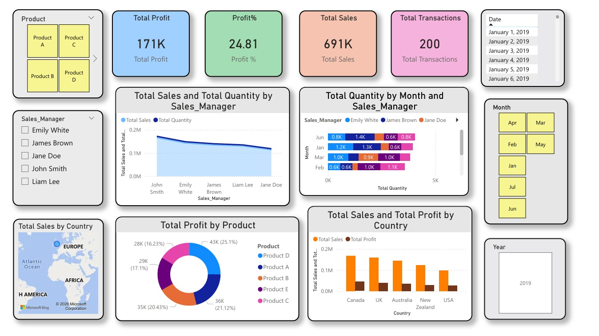
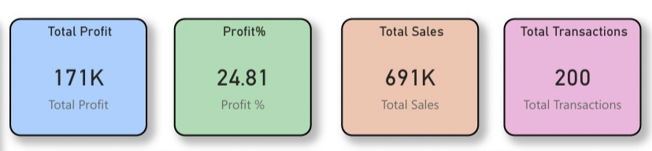

# 📊 Interactive Sales Analytics Dashboard

> A Power BI dashboard designed to analyze sales performance across products, managers, regions, and time.

---

## 🚀 Overview
This project transforms raw sales data into meaningful insights using interactive Power BI visualizations.  
It helps in tracking performance, comparing metrics, and identifying trends efficiently.

---

## 📌 Problem Statement
Sales data is complex and difficult to analyze manually. Without proper visualization:
- Trends remain hidden  
- Performance comparison is difficult  
- Decision-making becomes slow  

This dashboard provides **clear, interactive, and centralized analysis**.

---

## 🎯 Objectives
- Analyze sales across multiple dimensions  
- Track KPIs like sales, profit, and transactions  
- Compare performance by managers and products  
- Enable interactive data exploration  

---

## 🧠 Key Insights
- 📈 Sales performance varies across **sales managers**  
- 🛍️ Certain products generate higher profit contribution  
- 🌍 Sales distribution differs by country  
- 📅 Monthly trends show fluctuations in demand  
- 🎯 Filters allow quick drill-down analysis  

---

## 📊 Dashboard Preview

### 🔹 Full Dashboard Overview

---

## 📈 Detailed Analysis

### 📌 KPI Summary

### 👥 Sales Performance by Manager

### 📅 Monthly Quantity Analysis

### 🍩 Profit Distribution by Product

### 🌍 Geographic Sales Distribution

### 📊 Sales vs Profit by Country

### 🎛️ Interactive Filters

---

## ⚙️ Features
- KPI Cards (Sales, Profit, Profit %, Transactions)  
- Sales Manager Performance Analysis  
- Product-wise Profit Distribution  
- Country-level Sales Insights  
- Monthly Trend Analysis  
- Interactive Filters (Product, Manager, Date, Month, Year)  

---

## 🛠️ Tech Stack
- Power BI Desktop  
- Microsoft Excel  
- Data Modeling  

---

## 📂 Project Structure

- **screenshots/**
  - dashboard_overview.jpg  
  - kpi_cards.jpg  
  - sales_manager_analysis.jpg  
  - monthly_quantity.jpg  
  - map_view.jpg  
  - product_profit.jpg  
  - country_sales_profit.jpg  
  - filters.jpg  

- **dataset/**  
- **dashboard.pbix**  
- **README.md**  

---

## ▶️ How to Use
1. Download the `.pbix` file  
2. Open in Power BI Desktop  
3. Use filters (slicers) to explore data  
4. Click on visuals for interactive filtering  

---

## 📎 Repository
👉 https://github.com/sanket1035/interactive-sales-analytics-

---

## 📌 Conclusion
This dashboard simplifies complex sales data into intuitive visual insights, enabling better analysis and faster decision-making.

---

## ⚠️ Note
This project is for academic and analytical purposes.
